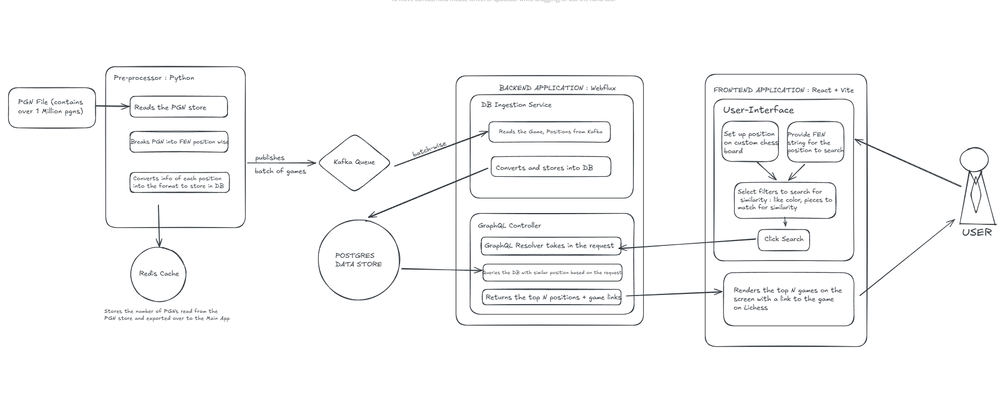

# ♟️ Chess Similarity Search Engine

A full-stack, containerized application (built in a way that it can be easily scaled as well) to explore and analyze chess positions based on structural similarity — built to help players discover recurring human ideas rather than rely solely on engine precision.

Yes, engines exist — and yes, they can tell us the best move in any given position. But anyone who has passionately played chess knows that while the opening phase is often well-studied, the middlegame can feel like a wilderness. Players may be familiar with the first 10–15 moves of an opening, but once theory ends, they’re often left improvising.

This project aims to bridge that gap — by surfacing patterns, structures, and motifs that arise across thousands of human games. Middlegame ideas aren’t just position-specific — many emerge from structural features. A certain pawn chain might demand a pawn break at a typical moment. Specific exchanges may lead to critical outposts. Recognizing these recurring structures can help players build intuition and formulate practical plans.

The core idea here is to make the ***middlegame*** more studyable. Human brains are remarkably good at learning from patterns — and this tool brings that pattern recognition to the study of real chess games. It's not about finding the best move, it's about finding familiar territory.

---

## 🚀 Features

- 🔎 **GraphQL-based similarity search** for chess positions
- 📦 **Python preprocessor** to parse PGN files and publish to Kafka
- 🧠 **Reactive Spring Webflux backend** with Kafka consumer, PostgreSQL persistence and querying logic
- 💡 **Bitboard and string-based matching logic** for position similarity
- 🖥️ **React + Vite frontend** to input FENs or create position on chess board and visualize results
- 🐳 Fully containerized using Docker and Docker Compose

---

## 🧰 Tech Stack

| Layer        | Technology                              |
|--------------|-----------------------------------------|
| Frontend     | React, Vite, GraphQL Client             |
| Backend      | Java 17, Spring Boot WebFlux, GraphQL   |
| Preprocessor | Python 3.10, kafka-python, redis        |
| Messaging    | Kafka, Zookeeper                        |
| Database     | PostgreSQL (R2DBC)                      |
| Cache        | Redis                                   |
| DevOps       | Docker, Docker Compose                  |

---

## 🧱 System Architecture

This project follows a modular, event-driven design pattern that makes it easy to scale each component independently. Here's a high-level overview of how it works:



- **PGN Preprocessor (Python):** Reads PGN files, extracts FEN positions, and publishes structured data in batches via Kafka. Uses Redis to track progress of how many games have been read from the PGN file so that subsequent runs can continue processing from the next game in the PGN file.
- **Backend Application (Spring WebFlux):** Acts as the core search engine. It consumes game data from Kafka, stores positions and games in PostgreSQL, and handles incoming GraphQL queries. It includes the logic to perform structure-based similarity search by filtering and ranking positions from the database based on provided criteria (like pawns, pieces, and color). 
- **Frontend Application (React + Vite):** Provides a user-friendly interface to input FEN strings or use a chessboard to search for similar positions based on structural features. Each position output also has a direct link to the game played on Lichess which can be used for further evaluation.

---

## ⚙️ Scalability

This project is designed with scalability in mind, making it ideal for future growth, cloud deployment, or large dataset processing.

- **Kafka-based ingestion** decouples parsing from storage, enabling horizontal scaling of consumers and producers
- **Stateless backend (Spring WebFlux)** handles concurrent GraphQL queries efficiently and is ready for Kubernetes, load balancers, etc.
- **PostgreSQL schema with bitboard optimizations** ensures fast lookups and indexing for high-performance queries
- **Redis-backed preprocessor batching** allows checkpointing and distributed ingestion
- **Frontend is built on Vite/React**, making it lightweight and easy to deploy on any static CDN or edge server

With each component running independently via Docker, the entire system is modular and ready for:

- Distributed processing  
- Cloud-native scaling  
- Integration with advanced vector search or LLM-based game insights in the future (Will start work on this soon)

---

## 📁 Project Structure

```
chess-similarity-project/
├── chess-app/              # Spring Boot WebFlux backend
├── chess-app-frontend/     # React + Vite frontend
├── pre-processor/          # Python PGN preprocessor with Kafka & Redis
├── db-init/                # init.sql for preloaded games & schema
├── docker-compose.yml      # Service orchestration
├── data/                   # Mount PGN files here (not tracked)
├── images/                 # Images used in readme
└── README.md
```

---

## ⚙️ Running the Application (Docker)

1. Clone the repository:

```bash
git clone https://github.com/gourav2k/chess-similarity-search.git
cd chess-similarity-search
```
2. How to Build the Database
There are two ways to set up the PostgreSQL database with chess positions:
#### Option 1: Parse Your Own PGN File

1. Download any `.pgn.zst` file from [https://database.lichess.org](https://database.lichess.org)
2. Extract it and place it inside the `data/` directory
3. Run the preprocessor like this:

```bash
docker-compose run -v $(pwd)/data:/data preprocessor /data/{your_file.pgn} --max-games 2500000
```
💡 This step is safe to run in multiple passes, since Redis tracks progress. However, reading millions of games may take time and use significant disk space.

#### Option 2: Use Preloaded SQL Dump (Recommended for Demo)

1. Download the .sql file I’ve shared : [Database Dump Link](https://tinyurl.com/2amdv3kd)
2. Place the file inside the db-init/ directory
3. Proceed to the next step (docker-compose up --build)

The application will auto-load 200K+ positions and be immediately ready to query!

3. Start all services:

```bash
docker-compose up --build
```

4. Access the app:
- Frontend: [http://localhost:3000](http://localhost:3000)
- GraphQL Playground: [http://localhost:8080/graphql](http://localhost:8080/graphql)

---

## 🧪 Sample GraphQL Query

```graphql
query FindSimilarPositionsByFen($fen: String!, $request: SimilarityRequestInput!) {
  findSimilarPositionsByFen(fen: $fen, request: $request) {
    similarityScore
    moveNumber
    position {
      fen
    }
    game {
      whiteName
      blackName
      result
      site
      whiteElo
      blackElo
    }
  }
}
```

### 📦 Sample Variables

```json
{
  "fen": "2r1r1k1/5ppp/b3p3/p2p4/5n2/PBP4P/2P3P1/3RR1K1 w - - 0 25",
  "request": {
    "color": "WHITE",
    "selectedPieces": ["PAWN", "BISHOP"],
    "limit": 10
  }
}
```
---

## 🔁 Ingesting a New PGN File

```bash
docker-compose run -v $(pwd)/data:/data preprocessor /data/lichess_file.pgn --max-games 100000
```

- Tracks progress using Redis
- Publishes parsed games+positions data to Kafka

---
## 🧪 Local Setup (Non-Docker)

If you prefer to run the project locally without Docker (for development or debugging), follow these steps:

---

### 🛠 Prerequisites

- Java 17+
- Python 3.10+
- Node.js (v18 or higher)
- PostgreSQL 14+ installed locally
- Redis running locally
- Kafka + Zookeeper running locally (Docker images recommended)

---

### 1. Set Up the Database

Ensure your local Postgres DB has the required tables and data. You can either:

- Ingest a `.pgn` file using the Python preprocessor
```bash
cd pre-processor
python main.py /path/to/file.pgn --batch-size 100 --max-games 100000
```
Make sure redis and kafka connections are pointing to local services via .env.local.

- Or restore the `init.sql` dump manually into Postgres from this link - [Database Dump Link](https://tinyurl.com/2amdv3kd):
  
```bash
psql -U postgres -d chess_positions_db -f db-init/chess_app_db.sql
```

### 2. Start the Backend (Spring WebFlux)
```bash
cd chess-app
./gradlew bootRun
```
Make sure application.properties is pointing to your local Postgres, Redis, and Kafka setup.

### 3. Start the Frontend (React + Vite)
```bash
cd chess-app-frontend
npm install
npm run dev
```
Ensure your .env.local contains:
```bash
VITE_WEBFLUX_BACKEND_URL=http://localhost:8080
```
### ✅ You're good to go!
- Visit frontend at: [http://localhost:5173](http://localhost:5173)
- Access GraphQL: [http://localhost:8080/graphql](http://localhost:8080/graphql)

---
## 📜 License

This project is licensed under the [MIT License](LICENSE).

---

## 🙌 Credits

- Built using open PGN data from [Lichess](https://database.lichess.org/)
- Designed & engineered by [@gourav2k](https://github.com/gourav2k)
